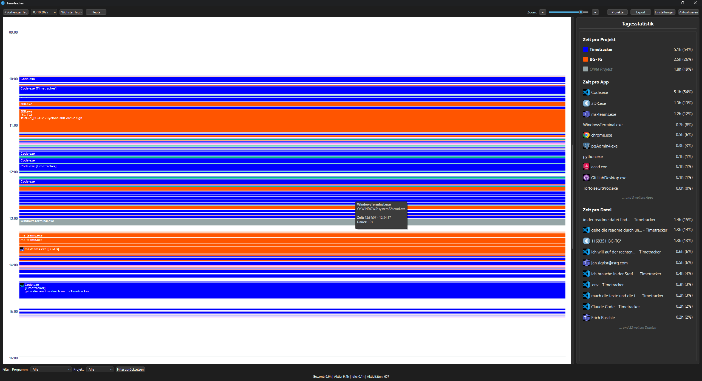

# TimeTracker

Eine plattformübergreifende Desktop-Anwendung zur automatischen Zeiterfassung Ihrer Computeraktivitäten.

## Überblick

TimeTracker ist eine intelligente Zeiterfassungsanwendung, die automatisch verfolgt, welche Anwendungen und Fenster Sie nutzen. Die Anwendung läuft im Hintergrund und bietet detaillierte Einblicke in Ihre Produktivität durch eine intuitive grafische Benutzeroberfläche. Die Erfassten Zeiten können dann Projekten zugewiesen werden.

### Hauptfunktionen

- **Automatisches Activity Tracking** - Erfasst aktive Anwendungen und Fenstertitel
- **Projektmanagement** - Zuordnung von Aktivitäten zu Projekten
- **Timeline-Visualisierung** - Grafische Darstellung Ihrer täglichen Aktivitäten
- **Export-Funktionen** - Datenexport in Excel, PDF und CSV
- **System Tray Integration** - Läuft diskret im Hintergrund
- **Idle-Erkennung** - Automatische Erkennung von Inaktivität
- **Konfigurierbare Filterregeln** - Ignoriere bestimmte Anwendungen
- **SQLite-Datenbank** - Lokale Datenspeicherung ohne externe Abhängigkeiten

## Screenshots



## Systemanforderungen

- **Betriebssystem**: Windows
- **Python**: 3.9 oder höher
- **Festplattenspeicher**: ~50 MB

## Installation

### 1. Repository klonen

```bash
git clone https://github.com/[username]/Timetracker.git
cd Timetracker
```

### 2. Virtuelle Umgebung erstellen (empfohlen)

```bash
python -m venv venv
```

### 3. Virtuelle Umgebung aktivieren

**Windows:**
```bash
venv\Scripts\activate
```

**macOS/Linux:**
```bash
source venv/bin/activate
```

### 4. Abhängigkeiten installieren

```bash
pip install -r requirements.txt
```

## Verwendung

### Anwendung starten

```bash
python src/main.py
```

### Erste Schritte

1. **Erstes Fenster öffnet sich automatisch** - Die Hauptoberfläche zeigt nach dem Start die aktuelle Timeline an
2. **System Tray Icon** - Die Anwendung minimiert sich in die Taskleiste
   - Doppelklick öffnet das Hauptfenster
   - Rechtsklick zeigt Optionen (Öffnen, Pausieren, Beenden)
3. **Projekte erstellen** - Wechseln Sie zum "Projekte"-Tab, um neue Projekte anzulegen
4. **Aktivitäten zuordnen** - Ordnen Sie vergangene oder aktuelle Aktivitäten Projekten zu
5. **Daten exportieren** - Exportieren Sie Berichte über das Menü "Datei" → "Exportieren"

## Projektstruktur

```
Timetracker/
├── src/
│   ├── main.py                 # Einstiegspunkt der Anwendung
│   ├── core/
│   │   ├── database.py         # SQLite-Datenbankmanagement
│   │   ├── tracker.py          # Hauptlogik für Activity Tracking
│   │   └── platform/
│   │       └── windows.py      # Windows-spezifisches Tracking
│   ├── gui/
│   │   ├── main_window.py      # Hauptfenster
│   │   ├── timeline.py         # Timeline-Visualisierung
│   │   ├── projects.py         # Projektverwaltung
│   │   ├── export_dialog.py    # Export-Dialog
│   │   └── settings_dialog.py  # Einstellungen
│   ├── utils/
│   │   ├── config.py           # Konfigurationsverwaltung
│   │   ├── export.py           # Export-Funktionen
│   │   └── icon_cache.py       # Icon-Caching für Anwendungen
│   └── models/                 # Datenmodelle
├── resources/
│   └── icons/                  # Anwendungs-Icons
├── requirements.txt            # Python-Abhängigkeiten
└── README.md                   # Diese Datei
```

## Konfiguration

Die Konfigurationsdatei wird automatisch erstellt unter:
- **Windows**: `%USERPROFILE%\.timetracker\config.json`

### Beispielkonfiguration

```json
{
  "poll_interval": 2,
  "idle_threshold": 300,
  "ignored_apps": ["lockapp.exe", "screensaver.exe"],
  "ignored_titles": ["Passwort", "Private"]
}
```

## Datenbank

Die SQLite-Datenbank wird automatisch erstellt unter:
- **Windows**: `%USERPROFILE%\.timetracker\timetracker.db`

Die Datenbank enthält folgende Tabellen:
- `activities` - Einzelne Aktivitätseinträge
- `projects` - Projektdefinitionen
- `project_rules` - Automatische Zuordnungsregeln
- `settings` - Anwendungseinstellungen

## Entwicklung

### Entwicklungsumgebung einrichten

```bash
# Repository forken und klonen
git clone https://github.com/[your-username]/Timetracker.git
cd Timetracker

# Virtuelle Umgebung erstellen und aktivieren
python -m venv venv
source venv/bin/activate  # oder venv\Scripts\activate unter Windows

# Abhängigkeiten installieren
pip install -r requirements.txt

# Anwendung im Entwicklungsmodus starten
python src/main.py
```

### Beiträge

Beiträge sind willkommen! Bitte folgen Sie diesen Schritten:

1. Forken Sie das Repository
2. Erstellen Sie einen Feature-Branch (`git checkout -b feature/AmazingFeature`)
3. Committen Sie Ihre Änderungen (`git commit -m 'Add some AmazingFeature'`)
4. Pushen Sie den Branch (`git push origin feature/AmazingFeature`)
5. Öffnen Sie einen Pull Request

### Code-Stil

- Folgen Sie PEP 8 für Python-Code
- Verwenden Sie aussagekräftige Variablen- und Funktionsnamen
- Dokumentieren Sie Funktionen mit Docstrings
- Fügen Sie Kommentare für komplexe Logik hinzu

## Technologie-Stack

- **GUI Framework**: PyQt6
- **Datenbank**: SQLite3
- **System-Integration**: psutil, pywin32
- **Datenverarbeitung**: pandas
- **Export**: reportlab (PDF), openpyxl (Excel)

## Lizenz

MIT

## Autor

Jan Sigrist

## Changelog

### Version 0.2.0 (Aktuell)
- Wechsel von PostgreSQL zu SQLite für einfachere Installation
- Verbesserte Projektmanagement-Funktionen
- Export-Funktionalität für Excel, PDF und CSV
- Icon-Caching für bessere Performance

### Version 0.1.0
- Initiale Version mit grundlegendem Activity Tracking
- PostgreSQL-Unterstützung
- System Tray Integration

## Bekannte Probleme

- macOS und Linux Support noch nicht implementiert
- Icon-Extraktion funktioniert nur unter Windows

## Support

Bei Fragen oder Problemen erstellen Sie bitte ein [Issue](https://github.com/[username]/Timetracker/issues) im GitHub-Repository.

## Roadmap

- [ ] Cloud-Synchronisation
- [ ] Erweiterte Statistiken und Analysen
- [ ] API für Drittanbieter-Integrationen
